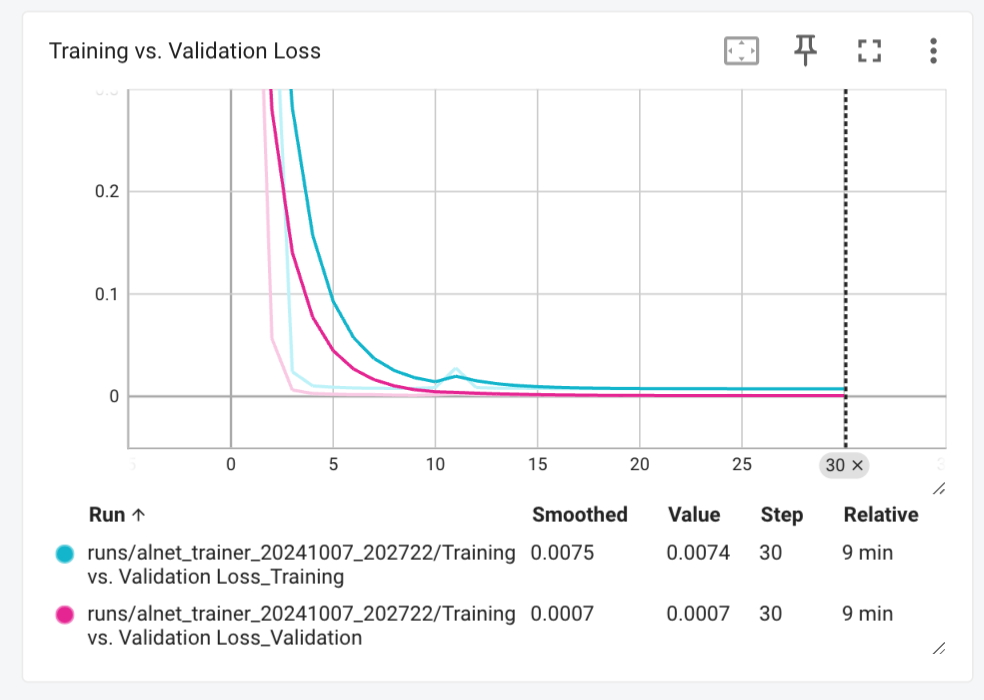

# Auto-Lag Networks for Valve Condition Prediction

This repository contains a machine learning solution to predict whether the valve condition of a hydraulic system is optimal (100%) or not, based on sensor data from 2000 cycles. 

The problem was modeled as a **multivariate time series** classification task.
I applied **Auto-Lag Networks (ALNs) For Real Valued Sequence to Sequence Prediction**, a novel archite, which automatically learn relevant lag structures and make sequence-to-sequence predictions.

## Problem Description

We aim to predict the valve condition (optimal or non-optimal) based on the following data:
- **PS2 (Pressure in bar, sampled at 100Hz)**
- **FS1 (Volume flow in l/min, sampled at 10Hz)**
- **Profile (Contains the valve condition)**

## Approach

### Auto-Lag Networks (ALNs)
The solution leverages Auto-Lag Networks, a specialized neural network architecture designed for real-valued sequence-to-sequence prediction. ALNs are ideal for this task because they can automatically select relevant time lags, eliminating the need for manual lag specification, which is crucial in time-series forecasting problems.

A key feature of ALNet is its **attention layer**, which acts as an **auto-lag selector** within the observation window. This attention mechanism allows the model to dynamically focus on the most relevant time lags, making the architecture highly efficient and effective for complex time-series prediction tasks. This enables ALNet to outperform traditional methods that require manual lag determination, especially in scenarios involving irregular or high-frequency signals, such as pressure and volume flow data.

As the author of the ALNet paper, presented at ICANN 2019 in Berlin, this approach has been recognized for its ability to dynamically capture relevant temporal dependencies in time-series data, making it an excellent fit for this valve condition prediction challenge. The problem is framed as a binary classification task, where the goal is to classify each cycle's valve condition as either "Optimal" or "Non-Optimal."

### Multivariate Time Series Model
The model takes two time series as input (pressure and volume flow) and also computes additional features called **a_priori_vars**, which include statistics such as the mean, median, variance, and standard deviation for both time series. These features are incorporated into the network to improve prediction accuracy.

### Web Application
A web interface is built using **Flask** to provide a simple interface for users to input a cycle ID and receive the prediction for whether the valve condition is optimal. The backend loads the trained model and processes the input to generate the prediction in real-time.

### Containerization
To ensure easy deployment, the application is containerized using **Docker**. This allows the app to run in any environment with minimal setup.

## Directory Structure
- `app.py`: Flask application to serve predictions.
- `make_inference.py`: Used by the app to make inference.
- `utils.py`: Contains utilitary functions such as the `read_and_parse_dataset` that is used to read and build the dataset from the txt files.
- `model.py`: Pytorch implementation au AutoLag Net for valve condition prédiction.
- `train.py`: Script to train the Auto-Lag Network on the dataset.
- `sensor_dataset.py`: Defines the custom PyTorch Dataset for loading sensor data.
- `metrics.py`: Computes several metrics to evaluate the model.
- `Dockerfile`: Defines the Docker container configuration.
- `templates/make_predictions.html`: HTML template for the prediction form.

- `templates/index.html`: HTML template for displaying all the prédictions made.

- `templates/base.html`: Base HTML web template.

## How to Run

### 1. Clone the repository
```bash
git clone git@github.com:wambagilles/Tech_test_Dataswati_-by_VIF.git
```

### 2. Build the Docker Image
```bash
docker build -t valve-condition-app .
```

### 3. Run the Application
```bash
docker run -p 9696:9696 valve-condition-app
```

### 4. Access the Web App
Navigate to `http://localhost:9696/make_prediction` in your browser. You can input a cycle ID from the dataset and the app will return whether the valve condition is "Optimal" or "Non Optimal."

## Model Training

To train the model on the provided dataset:
1. Ensure that the data files (`ps2.txt`, `fs1.txt`, `profile.txt`) are placed in the `data_subset` folder.
2. Run the training script:
   ```bash
   python main.py
   ```

Training the model for around 27 epochs with a batch size of 6 on the training set, consisting of the first 2000 cycles, resulted in a **Binary Cross-Entropy loss of 0.0006** on the test set. The evaluation on the test set was equally impressive, achieving **100% precision, recall, and F1 score**.



These outstanding results not only highlight the efficiency of **Auto-Lag Networks**, but are also expected given the problem framing. By modeling the task as a **binary classification problem**, the challenge is simplified—any valve condition other than 100% is treated as non-optimal (0). This straightforward threshold makes classification easier, contributing to the model’s strong performance.

The trained model will be saved in the `checkpoints` folder and can be loaded for predictions.

## Bonus Features
- **Unit Testing**: Unit tests can be added to ensure correctness of data preprocessing and model inference.
- **Dockerized Application**: The code is containerized to facilitate easy deployment.
- **Web Interface**: A user-friendly web interface is provided for making predictions based on cycle ID.

## Future Work
- Improve the model accurance by expérimenting other ALNet architecures, Loss function, and standardize the input.
- Add extensive unit tests as well as CI/CD pipelines (non regression, coverage) to ease deployment of the application.
- Version the models and Dataset
- Add monitoring solutions like MLFLOW
- Deploy the app on a cloud platform for broader accessibility.


